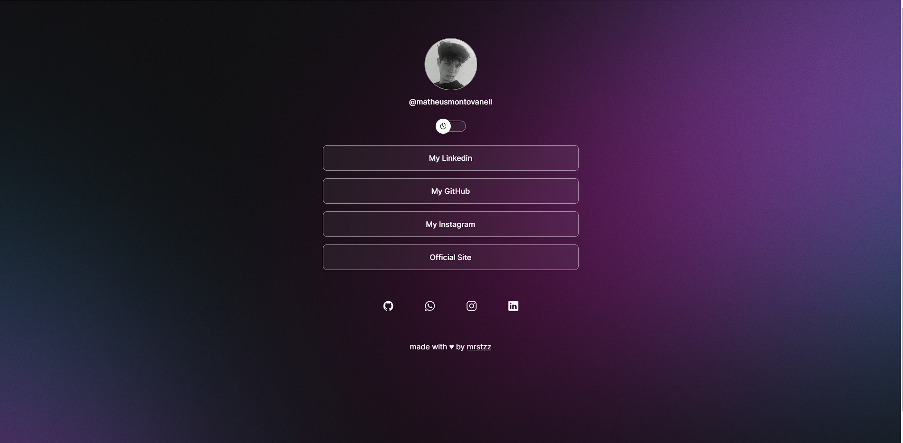
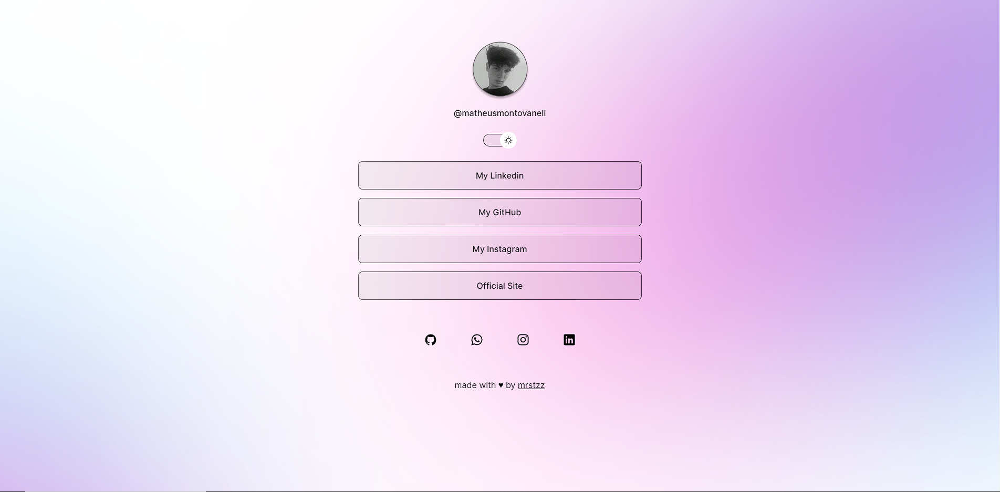

<h1 align="center"> DevLinks </h1>

Page with my Links with professional informations such as Professional profile, Portfolio and Social media.
This structure was based on maykbrito free lesson on Rocketseat plataform.  
<a href="https://lp.rocketseat.com.br/devlinks/inscricao?utm_source=github&utm_medium=descricao&utm_campaign=capture-devlinks&utm_term=organic&utm_content=descricao-github-mayk-brito">learn this project in video format by clicking here.</a>

  <a href="#-Technologies">Technologies</a>&nbsp;&nbsp;&nbsp;|&nbsp;&nbsp;&nbsp;
  <a href="#-project">Project</a>&nbsp;&nbsp;&nbsp;|&nbsp;&nbsp;&nbsp;
  <a href="#-layout">Layout</a>&nbsp;&nbsp;&nbsp;|&nbsp;&nbsp;&nbsp;
  <a href="#memo-licence">Licence</a>

  

 

  Original Layout
  

  My layout
  
  
  

## 🚀 Technologies

This project was developed with the follow technologies:

- HTML & CSS
- JavaScript
- Git & Github
- Figma

## 💻 Project

The purpose of this project is to be a link aggregator that works basically as a business card.

- [Access the finished project, online](https://maykbrito.github.io/devlinks)

## 🔖 Layout

You can visualize the project layout throught [THIS LINK](https://www.figma.com/community/file/1187422022288947321). It's necessary to have an account on [Figma](https://figma.com) to access it..

## :memo: Licence

This project is lincensed under the MIT license.

---

Made ♥ by Rocketseat :wave: [Join the community!](https://discord.gg/rocketseat)